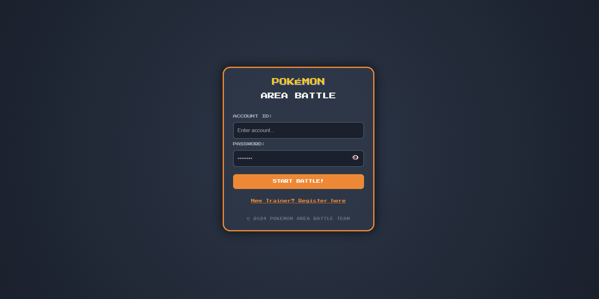
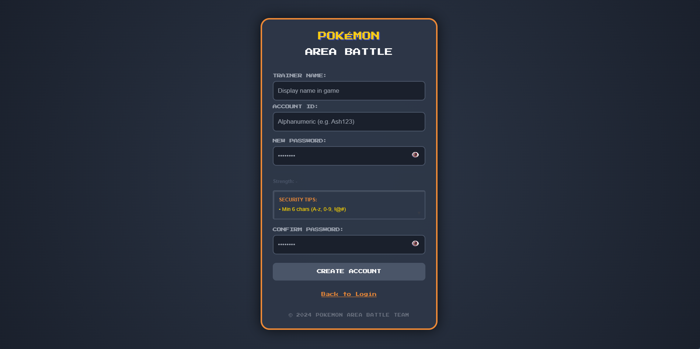
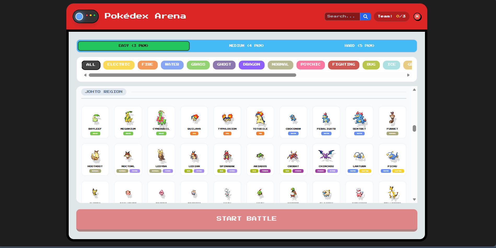
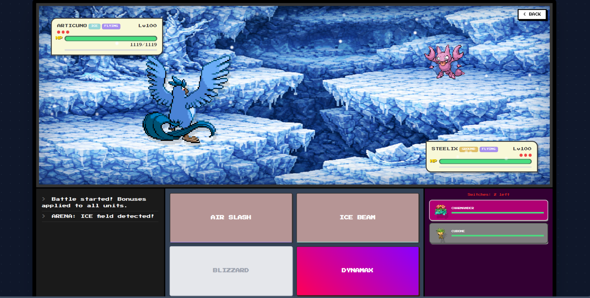

# 🎮 Pokemon Arena

> A modern turn-based Pokémon battle game built with HTML, CSS, and Vanilla JavaScript.

Pokemon Arena is a browser-based turn-based battle game inspired by classic Pokémon mechanics.  
The game features advanced combat systems including Legendary scaling, Dynamax mode, Ultimate skills (Fury system), Arena type boosts, and intelligent AI behavior.

---

# 📸 Gameplay Overview

---

# 1


**Login Screen**  
A clean pixel-style login interface for accessing the game.

---

# 2


**Register Screen**  
Create a new account with input validation before entering the game.

---

# 3


**Pokédex – Team Selection**

- Choose difficulty (Easy / Medium / Hard)  
- Filter Pokémon by type  
- Search functionality  
- Maximum of 3 Pokémon per team  
- Organized by region  

---

# 4


**Battle Scene**

- Turn-based combat system  
- Type effectiveness (x2 / x0.5 / x0)  
- STAB (Same Type Attack Bonus)  
- Critical hit system (x2 damage)  
- Legendary damage scaling  
- Boss multipliers  
- Arena-based type bonus  

---

# 5


**Dynamax System**

- Can be activated once per battle  
- Temporarily increases Pokémon size  
- Significant damage multiplier boost  
- Heavy screen shake and impact effects  

---

# 6


**Ultimate Skill (Fury System)**

- Fury builds up through normal attacks  
- Ultimate becomes available at 100 Fury  
- Fury resets immediately after use  
- Full-screen flash animation  
- High bonus damage  

---

# 7


**Switch Pokémon**

- Switch Pokémon during battle  
- Proper turn reset logic  
- Adds strategic depth to gameplay  

---

# 🔥 Damage Formula

Damage is calculated using:

Base Power  
× Legendary Multiplier  
× Type Multiplier  
× Arena Bonus  
× STAB  
× Random Factor (0.9 – 1.0)  
× Critical Multiplier  
+ Ultimate Bonus  
× Dynamax Multiplier  

The result is then processed through a final damage adjustment system.

---

# 🤖 Smart AI System

The enemy AI is capable of:

- Evaluating expected damage for each skill  
- Selecting the most optimal move based on type advantage  
- Activating Dynamax strategically  
- Using Ultimate when Fury is full  
- Prioritizing Legendary Pokémon when necessary  

---

# 🛠 Tech Stack

- HTML5  
- CSS3  
- Vanilla JavaScript  
- Custom-built battle engine  
- DOM-based animation system  

---

# 📂 Project Structure
# 🎮 Pokemon Arena

> A modern turn-based Pokémon battle game built with HTML, CSS, and Vanilla JavaScript.

Pokemon Arena is a browser-based turn-based battle game inspired by classic Pokémon mechanics.  
The game features advanced combat systems including Legendary scaling, Dynamax mode, Ultimate skills (Fury system), Arena type boosts, and intelligent AI behavior.

---

# 📸 Gameplay Overview

---

# 1


**Login Screen**  
A clean pixel-style login interface for accessing the game.

---

# 2


**Register Screen**  
Create a new account with input validation before entering the game.

---

# 3


**Pokédex – Team Selection**

- Choose difficulty (Easy / Medium / Hard)  
- Filter Pokémon by type  
- Search functionality  
- Maximum of 3 Pokémon per team  
- Organized by region  

---

# 4


**Battle Scene**

- Turn-based combat system  
- Type effectiveness (x2 / x0.5 / x0)  
- STAB (Same Type Attack Bonus)  
- Critical hit system (x2 damage)  
- Legendary damage scaling  
- Boss multipliers  
- Arena-based type bonus  

---

# 5


**Dynamax System**

- Can be activated once per battle  
- Temporarily increases Pokémon size  
- Significant damage multiplier boost  
- Heavy screen shake and impact effects  

---

# 6


**Ultimate Skill (Fury System)**

- Fury builds up through normal attacks  
- Ultimate becomes available at 100 Fury  
- Fury resets immediately after use  
- Full-screen flash animation  
- High bonus damage  

---

# 7


**Switch Pokémon**

- Switch Pokémon during battle  
- Proper turn reset logic  
- Adds strategic depth to gameplay  

---

# 🔥 Damage Formula

Damage is calculated using:

Base Power  
× Legendary Multiplier  
× Type Multiplier  
× Arena Bonus  
× STAB  
× Random Factor (0.9 – 1.0)  
× Critical Multiplier  
+ Ultimate Bonus  
× Dynamax Multiplier  

The result is then processed through a final damage adjustment system.

---

# 🤖 Smart AI System

The enemy AI is capable of:

- Evaluating expected damage for each skill  
- Selecting the most optimal move based on type advantage  
- Activating Dynamax strategically  
- Using Ultimate when Fury is full  
- Prioritizing Legendary Pokémon when necessary  

---

# 🛠 Tech Stack

- HTML5  
- CSS3  
- Vanilla JavaScript  
- Custom-built battle engine  
- DOM-based animation system  

---

# 📂 Project Structure

```
pokemon-arena/
│
├── index.html
├── game.html
├── icon-game.png
├── README.md
│
├── assets/
│   ├── 1.png
│   ├── 2.png
│   ├── 3.png
│   ├── 4.png
│   ├── 5.gif
│   ├── 6.gif
│   └── 7.gif
│
├── css/
│   ├── index.css
│   └── style.css
│
├── script/
│   ├── index.js
│   └── script.js
│
├── images/
│   ├── electric-map.png
│   ├── fire-map.png
│   ├── grass-map.png
│   ├── ice-map.png
│   ├── psychic-map.png
│   ├── rock-map.png
│   └── water-map.png
│
└── audio/ # Battle SFX & Background Music
    ├── click.mp3
    ├── dyn.mp3
    ├── dynamax.mp3
    ├── game-over.mp3
    ├── hit-damage.mp3
    ├── hit.mp3
    ├── low-hp-pokemon.mp3
    ├── missing.mp3
    ├── nem-pokemon-vao-san.mp3
    ├── nhac-nen.mp3
    ├── sound-login.mp3
    ├── switch-pokemon.mp3
    ├── transition.mp3
    ├── ultimate.mp3
    ├── vao-tr.mp3
    ├── vao-tran-dau.mp3
    └── win.mp3
```

# 🚀 How To Run

1. Clone the repository  
2. Open the project folder  
3. Run using Live Server (VS Code recommended)  

---

# ⚠ Disclaimer

Pokemon Arena is a fan-made project created for educational purposes only.  
This project is not affiliated with Nintendo or Game Freak.